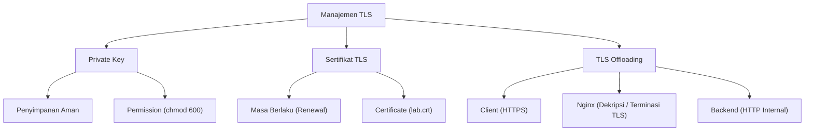
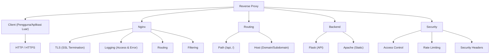

# LAPORAN PRAKTIKUM WORKSHOP DEVOPS
## Bab 4 — Web Service Container: Apache, Nginx, Reverse Proxy, dan TLS

**Disusun untuk Memenuhi Tugas Mata Kuliah:**  
Workshop DevOps

**Disusun Oleh:**
- **Dafa Ahmad Fahrisi** (3126640010)
- **Rahadyan Danang Susetyo Pranawa** (3126640054)
- **Tamisa Ulinda Marpaung** (3126640048)

**PROGRAM STUDI D4 LANJUT JENJANG TEKNIK INFORMATIKA**  
**POLITEKNIK ELEKTRONIKA NEGERI SURABAYA**  
**2026**

---

## 1. TUJUAN PRAKTIKUM

Praktikum Bab 4 bertujuan memahami pengelolaan web service berbasis container menggunakan Apache HTTP Server dan Nginx. Praktikum mencakup pembuatan konfigurasi web server, virtual host, reverse proxy, penerapan TLS self-signed, serta pembacaan access log dan error log melalui bind mount. Berdasarkan materi Bab 4, web service dipandang sebagai boundary antara client, jaringan, dan logika aplikasi sehingga konfigurasi web layer juga menjadi bagian dari aspek keamanan dan operasional.

Kompetensi yang diharapkan dari praktikum ini adalah sebagai berikut:
- Menjalankan Apache dan Nginx dengan konfigurasi custom.
- Membuat virtual host berbasis nama.
- Mengarahkan request melalui Nginx ke backend service menggunakan reverse proxy.
- Menerapkan HTTPS menggunakan sertifikat self-signed.
- Melakukan verifikasi service container.
- Melakukan troubleshooting terhadap web service dan container.

---

## 2. DASAR TEORI

Apache HTTP Server dan Nginx merupakan web server yang dapat digunakan sebagai origin server, penyaji file statis, maupun reverse proxy. Pada lingkungan container, konfigurasi dapat dipasang melalui bind mount atau image turunan sehingga konfigurasi lebih mudah dipisahkan dari aplikasi dan dapat dijalankan kembali secara konsisten. Apache menggunakan direktori konfigurasi dan document root yang berbeda dari Nginx, sedangkan Nginx memiliki fungsi `proxy_pass` yang dapat digunakan untuk meneruskan request ke service internal.

### Perbandingan Web Server

#### Apache HTTP Server
Apache HTTP Server merupakan web server yang dikenal memiliki arsitektur modular dan fleksibel. Apache menyediakan berbagai modul yang dapat digunakan untuk menyesuaikan fungsi web server sesuai kebutuhan, termasuk modul untuk autentikasi, SSL/TLS, dan reverse proxy. Dalam pengelolaan virtual host, Apache menggunakan konfigurasi `<VirtualHost>` sehingga beberapa website dapat dijalankan pada satu server. Apache cocok digunakan sebagai web server yang membutuhkan fleksibilitas konfigurasi dan dukungan terhadap berbagai modul serta kebutuhan aplikasi.

#### NGINX
Nginx merupakan web server yang menggunakan arsitektur event-driven dan banyak digunakan untuk menangani koneksi secara efisien, terutama ketika jumlah koneksi simultan cukup besar. Selain menyajikan konten statis, Nginx memiliki kemampuan yang kuat sebagai reverse proxy, load balancer, dan terminasi TLS. Konfigurasi virtual host pada Nginx dilakukan melalui blok server dengan `server_name`, sedangkan penerusan request ke backend dilakukan menggunakan `proxy_pass`. Dalam arsitektur praktikum, Nginx dapat ditempatkan sebagai lapisan depan yang menerima request dari client, melakukan routing dan TLS termination, kemudian meneruskan request ke Apache atau service backend melalui jaringan internal.

---

### Mind Map 1: Manajemen TLS, Penyimpanan Private Key, dan TLS Offloading



Mind map Manajemen TLS menggambarkan tiga komponen utama dalam penerapan keamanan komunikasi menggunakan TLS, yaitu sertifikat TLS, private key, dan TLS offloading:
1. **Sertifikat TLS**: Digunakan untuk mengidentifikasi server dan memungkinkan komunikasi antara client dan server dilakukan melalui HTTPS. Sertifikat memiliki masa berlaku sehingga perlu diperhatikan proses pembaruan (*renewal*) agar koneksi HTTPS tetap dapat digunakan.
2. **Private Key**: Merupakan bagian penting dalam keamanan TLS karena digunakan dalam proses kriptografi dan harus disimpan secara aman. Akses terhadap private key perlu dibatasi menggunakan permission yang sesuai (misal `chmod 600`) dan tidak seharusnya disimpan secara sembarangan, misalnya dimasukkan langsung ke repository kode.
3. **TLS Offloading**: Merupakan mekanisme ketika proses terminasi TLS dilakukan pada server perantara seperti Nginx. Client melakukan koneksi HTTPS ke Nginx, kemudian Nginx menangani proses TLS dan meneruskan request ke backend melalui jaringan internal. Dengan demikian, pengelolaan TLS dapat dipusatkan pada Nginx, sedangkan backend seperti Apache atau Flask tidak perlu menangani terminasi TLS secara langsung.

---

### Mind Map 2: Cara Kerja Reverse Proxy, Routing, dan Filter Keamanan



Mind map Reverse Proxy menjelaskan alur komunikasi antara client, Nginx, dan backend. Client dapat mengirimkan request melalui HTTP atau HTTPS yang kemudian diterima oleh Nginx:
- **Client (Pengguna/Aplikasi Luar)**: Pihak luar yang mengirimkan permintaan (*request*) akses layanan web atau API menggunakan protokol HTTP/HTTPS. Dalam arsitektur reverse proxy, client tidak pernah berhubungan langsung dengan server backend, melainkan mengirim seluruh lalu lintas data ke pintu masuk utama, yaitu Nginx.
- **Nginx**: Berdiri di garda terdepan sebagai perantara yang menerima request client untuk diteruskan ke jaringan internal. Nginx mengelola empat fitur utama: TLS (*SSL Termination*) untuk memproses enkripsi data, Logging untuk mencatat aktivitas dan error sistem, Routing untuk mengarahkan rute request, serta Filtering untuk memblokir lalu lintas berbahaya sebelum menyentuh aplikasi.
- **Routing**: Aturan pengarahan request Nginx menuju server backend yang sesuai. Pengarahan ini dilakukan berdasarkan dua kriteria utama: Path (berdasarkan direktori/endpoint URL, seperti `/api` atau `/static.html`) dan Host (berdasarkan nama domain/subdomain, seperti `app.domain.com` atau `api.domain.com`).
- **Backend**: Server backend (seperti Flask, Node.js/Express, atau Apache) bertugas menjalankan logika bisnis dan pemrosesan data di dalam lingkungan internal yang terisolasi. Layanan ini bersifat tertutup dan tidak pernah mengekspos port-nya ke internet umum, melainkan hanya menerima request yang disaring dan diteruskan (`proxy_pass`) oleh Nginx.
- **Security**: Lapisan keamanan pada proxy berfungsi melindungi backend dari serangan siber. Fiturnya meliputi Access Control untuk pembatasan IP/otentikasi, Rate Limiting untuk membatasi frekuensi request guna mencegah serangan DoS/brute force, serta Security Header untuk menyuntikkan header proteksi browser dari celah Clickjacking dan XSS.

---

## 3. ALAT DAN LINGKUNGAN

| Komponen | Hasil Identifikasi |
|---|---|
| **Operating System** | Ubuntu / WSL |
| **Pengguna Eksekusi** | tamisa |
| **Direktori Kerja** | `~/docker-lab/bab-4` |
| **OpenSSL** | Tersedia (untuk generate sertifikat RSA 2048-bit) |
| **cURL** | curl 8.5.0 |
| **Docker Compose** | Terpasang, integrasi V2 aktif |
| **Base Images** | `nginx:alpine`, `httpd:2.4-alpine`, `python:3.12-slim` |

---

## 4. LANGKAH PRAKTIKUM

### 4.1 Persiapan Direktori dan Keamanan TLS

#### a. Menyiapkan struktur folder
```bash
tamisa@LAPTOP-E9ROMRSB:~$ mkdir -p ~/docker-lab/bab-4/{apache/sites,nginx/conf,certs,logs/nginx,app}
cd ~/docker-lab/bab-4
```

#### b. Membuat sertifikat TLS laboratorium dan proteksi hak akses lab.key
```bash
tamisa@LAPTOP-E9ROMRSB:~/docker-lab/bab-4$ openssl req -x509 -nodes -days 365 -newkey rsa:2048 \
  -keyout certs/lab.key -out certs/lab.crt \
  -subj "/CN=localhost/O=DevSecOps Docker Lab" \
  -addext "subjectAltName=DNS:localhost,IP:127.0.0.1"

chmod 600 certs/lab.key
chmod 644 certs/lab.crt
```

---

### 4.2 Penyusunan File Konfigurasi

Semua file konfigurasi dibuat dengan teks editor nano, mencakup:

#### a. `compose.yaml`
Mengatur orkestrasi 3 service, port mapping, dan isolasi network `web-net`. Nginx hanya dijalankan jika Flask sudah mencapai `condition: service_healthy`.

```yaml
services:
  proxy:
    image: nginx:alpine
    ports:
      - "127.0.0.1:8080:80"
      - "127.0.0.1:8443:443"
    volumes:
      - ./nginx/conf:/etc/nginx/conf.d:ro
      - ./certs:/etc/nginx/certs:ro
      - ./logs/nginx:/var/log/nginx
    networks:
      - web-net
    depends_on:
      apache-web:
        condition: service_started
      flask-app:
        condition: service_healthy

  apache-web:
    image: httpd:2.4-alpine
    volumes:
      - ./apache/sites:/usr/local/apache2/htdocs:ro
    networks:
      - web-net

  flask-app:
    build:
      context: ./app
    networks:
      - web-net
    healthcheck:
      test:
        - CMD
        - python
        - -c
        - "import urllib.request; urllib.request.urlopen('http://127.0.0.1:5000/health')"
      interval: 5s
      timeout: 3s
      retries: 5
      start_period: 5s

networks:
  web-net:
    driver: bridge
```

#### b. `nginx/conf/default.conf`
Blok server yang menangani redirect 80 ke 443, serta instruksi `proxy_pass` ke arah blok upstream Apache dan Flask.

```nginx
upstream apache_backend {
    server apache-web:80;
}

upstream flask_backend {
    server flask-app:5000;
}

server {
    listen 80;
    server_name localhost;
    return 301 https://$host:8443$request_uri;
}

server {
    listen 443 ssl;
    server_name localhost;

    ssl_certificate     /etc/nginx/certs/lab.crt;
    ssl_certificate_key /etc/nginx/certs/lab.key;
    ssl_protocols TLSv1.2 TLSv1.3;

    add_header X-Content-Type-Options "nosniff" always;
    add_header X-Frame-Options "DENY" always;
    add_header Referrer-Policy "no-referrer" always;

    location / {
        proxy_pass http://apache_backend;
        proxy_set_header Host $host;
        proxy_set_header X-Real-IP $remote_addr;
        proxy_set_header X-Forwarded-For $proxy_add_x_forwarded_for;
        proxy_set_header X-Forwarded-Proto $scheme;
    }

    location /api/ {
        proxy_pass http://flask_backend/;
        proxy_set_header Host $host;
        proxy_set_header X-Real-IP $remote_addr;
        proxy_set_header X-Forwarded-For $proxy_add_x_forwarded_for;
        proxy_set_header X-Forwarded-Proto $scheme;
    }
}
```

#### c. Aplikasi Backend
Pembuatan halaman `index.html` (untuk disajikan oleh Apache), serta kode API Python pada `app.py` beserta dependensinya (`requirements.txt`) dan berkas `Dockerfile` untuk kebutuhan build image.

**`apache/sites/index.html`**:
```html
<!DOCTYPE html>
<html lang="id">
<head>
    <meta charset="UTF-8">
    <title>DevSecOps Bab 4</title>
</head>
<body>
    <h1>Apache di Belakang Nginx</h1>
    <p>Halaman Bab 4 berhasil dilayani melalui reverse proxy.</p>
    <p><a href="/api/">Uji Flask API</a></p>
</body>
</html>
```

**`app/requirements.txt`**:
```text
Flask==3.1.2
gunicorn==23.0.0
```

**`app/app.py`**:
```python
from flask import Flask, jsonify, request

app = Flask(__name__)

@app.get("/")
def index():
    return jsonify(
        status="ok",
        service="flask-app",
        message="API Bab 4 berhasil diakses melalui Nginx",
        forwarded_proto=request.headers.get("X-Forwarded-Proto"),
    )

@app.get("/health")
def health():
    return jsonify(status="healthy"), 200
```

**`app/Dockerfile`**:
```dockerfile
FROM python:3.12-slim

WORKDIR /app

COPY requirements.txt .
RUN pip install --no-cache-dir -r requirements.txt

COPY app.py .

RUN useradd --system --uid 10001 --no-create-home appuser
USER appuser

EXPOSE 5000

CMD ["gunicorn", "--bind", "0.0.0.0:5000", "--workers", "2", "app:app"]
```

---

### 4.3 Dokumentasi Praktikum

#### a. Validasi Sintaks Konfigurasi Menggunakan `docker compose config`
```bash
tamisa@LAPTOP-E9ROMRSB:~/docker-lab/bab-4$ find . -maxdepth 3 -type f | sort
./apache/sites/index.html
./app/Dockerfile
./app/app.py
./app/requirements.txt
./certs/lab.crt
./certs/lab.key
./compose.yaml
./logs/nginx/access.log
./logs/nginx/error.log
./nginx/conf/default.conf

tamisa@LAPTOP-E9ROMRSB:~/docker-lab/bab-4$ docker compose config
name: bab-4
services:
  apache-web:
    image: httpd:2.4-alpine
    networks:
      web-net: null
    volumes:
      - type: bind
        source: /home/tamisa/docker-lab/bab-4/apache/sites
        target: /usr/local/apache2/htdocs
        read_only: true
  flask-app:
    build:
      context: /home/tamisa/docker-lab/bab-4/app
      dockerfile: Dockerfile
    healthcheck:
      test:
        - CMD
        - python
        - -c
        - import urllib.request; urllib.request.urlopen('http://127.0.0.1:5000/health')
      timeout: 3s
      interval: 5s
      retries: 5
      start_period: 5s
    networks:
      web-net: null
  proxy:
    depends_on:
      apache-web:
        condition: service_started
        required: true
      flask-app:
        condition: service_healthy
        required: true
    image: nginx:alpine
    networks:
      web-net: null
    ports:
      - mode: ingress
        host_ip: 127.0.0.1
        target: 80
        published: "8080"
        protocol: tcp
      - mode: ingress
        host_ip: 127.0.0.1
        target: 443
        published: "8443"
        protocol: tcp
    volumes:
      - type: bind
        source: /home/tamisa/docker-lab/bab-4/nginx/conf
        target: /etc/nginx/conf.d
        read_only: true
      - type: bind
        source: /home/tamisa/docker-lab/bab-4/certs
        target: /etc/nginx/certs
        read_only: true
      - type: bind
        source: /home/tamisa/docker-lab/bab-4/logs/nginx
        target: /var/log/nginx
networks:
  web-net:
    name: bab-4_web-net
    driver: bridge
```

#### b. Proses Build Image Python Flask dan Eksekusi Stack Container
```bash
tamisa@LAPTOP-E9ROMRSB:~/docker-lab/bab-4$ docker compose up -d --build
[+] Building 4.6s (13/13) FINISHED
 => [internal] load build definition from Dockerfile
 => => transferring dockerfile: 324B
 => [internal] load metadata for docker.io/library/python:3.12-slim
 => [internal] load .dockerignore
 => => transferring context: 2B
 => [1/4] FROM docker.io/library/python:3.12-slim
 => [internal] load build context
 => => transferring context: 83B
 => CACHED [2/4] WORKDIR /app
 => CACHED [3/4] COPY requirements.txt .
 => CACHED [4/4] RUN pip install --no-cache-dir -r requirements.txt
 => [5/5] COPY app.py .
 => [6/6] RUN useradd --system --uid 10001 --no-create-home appuser
 => exporting to image
 => => exporting layers
 => => writing image sha256:...
 => => naming to docker.io/library/bab-4-flask-app:latest
[+] Running 4/4
 ✔ Network bab-4_web-net        Created
 ✔ Container bab-4-apache-web-1 Started
 ✔ Container bab-4-flask-app-1  Healthy
 ✔ Container bab-4-proxy-1      Started
```

#### c. Pengecekan Status Operasional Seluruh Container
```bash
tamisa@LAPTOP-E9ROMRSB:~/docker-lab/bab-4$ docker compose ps
NAME                IMAGE                  COMMAND                  SERVICE      CREATED         STATUS                   PORTS
bab-4-apache-web-1  httpd:2.4-alpine       "httpd-foreground"       apache-web   2 minutes ago   Up 2 minutes             80/tcp
bab-4-flask-app-1   sha256:283fafe...      "gunicorn --bind 0.0..." flask-app    2 minutes ago   Up 2 minutes (healthy)   5000/tcp
bab-4-proxy-1       nginx:alpine           "/docker-entrypoint..."  proxy        2 minutes ago   Up 2 minutes             127.0.0.1:8080->80/tcp, 127.0.0.1:8443->443/tcp
```

#### d. Pengujian Redirect Trafik HTTP ke HTTPS (Status 301)
```bash
tamisa@LAPTOP-E9ROMRSB:~/docker-lab/bab-4$ curl -I http://localhost:8080/
HTTP/1.1 301 Moved Permanently
Server: nginx/1.31.6
Date: Fri, 02 Oct 2026 13:42:46 GMT
Content-Type: text/html
Content-Length: 169
Connection: keep-alive
Location: https://localhost:8443/
```

#### e. Pengujian Perutean Statis via HTTPS dan Perutean API Flask
```bash
tamisa@LAPTOP-E9ROMRSB:~/docker-lab/bab-4$ curl -k -I https://localhost:8443/
HTTP/1.1 200 OK
Server: nginx/1.31.6
Date: Fri, 02 Oct 2026 13:43:35 GMT
Content-Type: text/html
Content-Length: 282
Connection: keep-alive
Last-Modified: Fri, 02 Oct 2026 13:34:55 GMT
ETag: "11a-65cdb990458dd"
Accept-Ranges: bytes
X-Content-Type-Options: nosniff
X-Frame-Options: DENY
Referrer-Policy: no-referrer

tamisa@LAPTOP-E9ROMRSB:~/docker-lab/bab-4$ curl -k https://localhost:8443/
<!DOCTYPE html>
<html lang="id">
<head>
    <meta charset="UTF-8">
    <title>DevSecOps Bab 4</title>
</head>
<body>
    <h1>Apache di Belakang Nginx</h1>
    <p>Halaman Bab 4 berhasil dilayani melalui reverse proxy.</p>
    <p><a href="/api/">Uji Flask API</a></p>
</body>
</html>

tamisa@LAPTOP-E9ROMRSB:~/docker-lab/bab-4$ curl -k https://localhost:8443/api/
{"forwarded_proto":"https","message":"API Bab 4 berhasil diakses melalui Nginx","service":"flask-app","status":"ok"}
```

#### f. Pemeriksaan Access Log Nginx yang Tercatat Secara Persisten di Storage OS Host
```bash
tamisa@LAPTOP-E9ROMRSB:~/docker-lab/bab-4$ tail -n 20 logs/nginx/access.log
172.18.0.1 - - [02/Oct/2026:13:42:46 +0000] "HEAD / HTTP/1.1" 301 0 "-" "curl/8.5.0" "-"
172.18.0.1 - - [02/Oct/2026:13:42:54 +0000] "GET /api/ HTTP/1.1" 200 117 "-" "curl/8.5.0" "-"
172.18.0.1 - - [02/Oct/2026:13:43:35 +0000] "HEAD / HTTP/1.1" 301 0 "-" "curl/8.5.0" "-"
172.18.0.1 - - [02/Oct/2026:13:43:35 +0000] "GET / HTTP/1.1" 200 282 "-" "curl/8.5.0" "-"
172.18.0.1 - - [02/Oct/2026:13:43:43 +0000] "GET /api/ HTTP/1.1" 200 117 "-" "curl/8.5.0" "-"
```

#### g. Validasi Handshake TLS (`openssl s_client -brief`)
```bash
tamisa@LAPTOP-E9ROMRSB:~/docker-lab/bab-4$ openssl s_client -connect localhost:8443 -servername localhost -brief </dev/null
depth=0 CN = localhost, O = DevSecOps Docker Lab
verify error:num=18:self-signed certificate
CONNECTION ESTABLISHED
Protocol version: TLSv1.3
Ciphersuite: TLS_AES_256_GCM_SHA384
Peer certificate: CN = localhost, O = DevSecOps Docker Lab
Hash used: SHA256
Signature type: RSA-PSS
Verification error: self-signed certificate
Server Temp Key: X25519, 253 bits
DONE
```

#### h. Pemeriksaan Isolasi Jaringan — Inspect Network
```bash
tamisa@LAPTOP-E9ROMRSB:~/docker-lab/bab-4$ docker network inspect bab-4_web-net
[
  {
    "Name": "bab-4_web-net",
    "Id": "785d7376b61937c5c20e338a9a889f48213e941e4d326d59ba3473a2177eb34d",
    "Created": "2026-10-02T13:37:14.889752597Z",
    "Scope": "local",
    "Driver": "bridge",
    "EnableIPv6": false,
    "IPAM": {
      "Driver": "default",
      "Config": [
        {
          "Subnet": "172.18.0.0/16",
          "Gateway": "172.18.0.1"
        }
      ]
    },
    "Internal": false,
    "Containers": {
      "8faf5c1bb47cf24386f1ca3f60ae52a00d3660c8c798ad6481aa8a514140856b": {
        "Name": "bab-4-proxy-1",
        "IPv4Address": "172.18.0.4/16"
      },
      "956abc740827b1a3505a6ae08bd7404a518cbad1c41727f277b7243ed1da820": {
        "Name": "bab-4-apache-web-1",
        "IPv4Address": "172.18.0.2/16"
      },
      "cb26dc9ac66a6d70e83eaed35d51foc862b2468f95b44b8adac4a345452ac6c9": {
        "Name": "bab-4-flask-app-1",
        "IPv4Address": "172.18.0.3/16"
      }
    }
  }
]
```

#### i. Pengujian Akses Privat dari dalam Proxy ke Backend
```bash
tamisa@LAPTOP-E9ROMRSB:~/docker-lab/bab-4$ docker compose exec proxy wget -qO- http://apache-web/
<!DOCTYPE html>
<html lang="id">
<head>
    <meta charset="UTF-8">
    <title>DevSecOps Bab 4</title>
</head>
<body>
    <h1>Apache di Belakang Nginx</h1>
    <p>Halaman Bab 4 berhasil dilayani melalui reverse proxy.</p>
    <p><a href="/api/">Uji Flask API</a></p>
</body>
</html>

tamisa@LAPTOP-E9ROMRSB:~/docker-lab/bab-4$ docker compose exec proxy wget -qO- http://flask-app:5000/health
{"status":"healthy"}
```

#### j. Pemeriksaan Persistensi Error Log Nginx
```bash
tamisa@LAPTOP-E9ROMRSB:~/docker-lab/bab-4$ tail -n 20 logs/nginx/error.log
2026/10/02 13:40:19 [notice] 1#1: using the "epoll" event method
2026/10/02 13:40:19 [notice] 1#1: nginx/1.31.6
2026/10/02 13:40:19 [notice] 1#1: built by gcc 15.2.0 (Alpine 15.2.0)
2026/10/02 13:40:19 [notice] 1#1: OS: Linux 5.15.167.4-microsoft-standard-WSL2
2026/10/02 13:40:19 [notice] 1#1: getrlimit(RLIMIT_NOFILE): 1048576:1048576
2026/10/02 13:40:19 [notice] 1#1: start worker processes
2026/10/02 13:40:19 [notice] 1#1: start worker process 21
2026/10/02 13:40:19 [notice] 1#1: start worker process 22
```

#### k. Penghentian Stack Container
```bash
tamisa@LAPTOP-E9ROMRSB:~/docker-lab/bab-4$ docker compose down
[+] Running 4/4
 ✔ Container bab-4-proxy-1      Removed
 ✔ Container bab-4-apache-web-1 Removed
 ✔ Container bab-4-flask-app-1  Removed
 ✔ Network bab-4_web-net        Removed
```

---

## 5. HASIL PENGUJIAN DAN PEMBAHASAN

### 5.1 Hasil Pengujian

| Pemeriksaan (*Check Pass*) | Hasil Aktual | Status |
|---|---|:---:|
| **Validasi sintaks docker compose config** | Konfigurasi YAML berhasil dibaca dan dirender tanpa ada pesan error. | **Terpenuhi** |
| **Status healthcheck Flask** | Container `flask-app` sukses mencapai status `(healthy)` saat dicek menggunakan `docker compose ps`. | **Terpenuhi** |
| **Uji redirect HTTP ke HTTPS (Port 8080)** | Request ke port 8080 otomatis diarahkan ke HTTPS dengan balasan `HTTP/1.1 301 Moved Permanently`. | **Terpenuhi** |
| **Akses web statis via HTTPS (Port 8443)** | Nginx sukses mendekripsi koneksi dan menampilkan halaman HTML utama yang dilayani oleh backend Apache. | **Terpenuhi** |
| **Uji routing endpoint `/api/`** | Akses ke rute API berhasil mengembalikan respon JSON dari Flask (menampilkan status `ok` dan `forwarded_proto: https`). | **Terpenuhi** |
| **Validasi negosiasi protokol TLS** | Hasil pengujian `openssl s_client` membuktikan koneksi berhasil dibangun menggunakan protokol modern **TLSv1.3**. | **Terpenuhi** |
| **Isolasi jaringan backend** | Apache dan Flask terbukti tidak memiliki published port ke OS host, sementara pemetaan port keluar hanya dimiliki oleh Nginx. | **Terpenuhi** |
| **Persistensi access log Nginx di host** | Riwayat request klien (seperti IP, waktu, dan method HTTP) tersimpan rapi di dalam file `access.log` pada direktori OS host. | **Terpenuhi** |

---

### 5.2 Analisis Hasil

Hasil pengujian pada tabel di atas membuktikan esensi utama dari arsitektur microservices dan containerization. Nginx berhasil menjalankan perannya sebagai reverse proxy yang mengambil alih tugas komunikasi eksternal dan proses terminasi TLS pada port 8443. Pengalihan dari HTTP (8080) ke HTTPS berjalan otomatis, memaksa client menggunakan jalur yang aman (terenkripsi). 

Pada sisi backend, pembagian workload berjalan dengan sangat baik:
- Request ke root path (`/`) langsung di-routing ke Apache untuk menampilkan halaman web statis.
- Trafik ke endpoint `/api/` diteruskan ke framework Flask.

Berkat mekanisme **TLS Offloading** di Nginx, kinerja server Flask dan Apache menjadi jauh lebih ringan karena mereka tidak perlu melakukan proses dekripsi ulang. Komunikasi antarlayanan di dalam Docker network (`web-net`) menggunakan protokol HTTP biasa, namun sudah terjamin aman secara arsitektur karena terisolasi penuh dari akses internet publik.

---

### 5.3 Analisis Ancaman (*Threat Modeling*)

| Aset yang Dilindungi | Ancaman | Mitigasi yang Diterapkan di Lab | Dampak Jika Terjadi |
|---|---|---|---|
| **Kunci Privat TLS (`lab.key`)** | Kunci bocor karena disimpan di image docker publik, salah commit ke GitHub, atau izin baca file terlalu luas di OS host. | Izin file dikunci (`chmod 600`) dan dipetakan ke Nginx dengan atribut Read-Only (`:ro`). | Serangan *Man-in-the-Middle* (MitM); peretas bisa menyadap dan membaca data rahasia HTTPS klien. |
| **Lingkungan Root Container** | Eksekusi kode acak (RCE) apabila peretas menembus aplikasi Flask. | Dockerfile Flask mengatur aplikasi dijalankan menggunakan entitas non-root (`UID 10001`). | Peretas tidak bisa mengambil alih total sistem/container jika eksploitasi terjadi. |

---

### 5.4 Analisis Masalah dan Solusi (*Troubleshooting*)

Dalam implementasi arsitektur multi-container, salah satu kendala operasional yang sering terjadi saat tahap startup adalah **race condition**. Jika Nginx dijalankan tepat bersamaan dengan backend Flask, Nginx akan langsung mencoba me-resolve upstream `flask-app:5000`. Namun, karena Gunicorn dan framework Python membutuhkan waktu beberapa detik untuk proses binding ke port jaringan, Nginx akan gagal meneruskan koneksi dan menghasilkan error `502 Bad Gateway`.

**Solusi:**  
Diagnosis awal dilakukan dengan memeriksa log pada container proxy. Pendekatan paling efektif untuk mengatasi hal ini adalah dengan menambahkan parameter **healthcheck** pada service Flask, lalu mengatur dependensi Nginx di `compose.yaml` menjadi:
```yaml
depends_on:
  flask-app:
    condition: service_healthy
```
Konfigurasi ini menginstruksikan Docker daemon untuk menahan proses inisialisasi Nginx sampai endpoint `/health` Flask membalas dengan status 200 (healthy), sehingga masalah 502 dapat dihindari sepenuhnya sejak awal penjalanan stack.

---

### 5.5 Analisis Keamanan dan Rekomendasi

Apabila arsitektur laboratorium ini akan diimplementasikan pada lingkungan produksi, terdapat beberapa peningkatan keamanan yang direkomendasikan:

1. **Penggunaan Certificate Authority (CA) Resmi**  
   Mengganti sertifikat self-signed dengan sertifikat dari CA publik terpercaya (seperti Let's Encrypt melalui agen Certbot). Hal ini esensial agar browser klien dapat memvalidasi identitas server secara otomatis tanpa memunculkan peringatan bahaya (*security warning*).

2. **Penerapan Security Headers (HSTS & CSP)**  
   Mengonfigurasi Nginx untuk menyuntikkan header keamanan, khususnya *Strict-Transport-Security* (HSTS), guna mencegah peretas memaksakan koneksi turun kembali ke protokol HTTP (*downgrade attack*).

---

## 6. EVALUASI DAN LATIHAN MANDIRI

### 1.) Mengapa reverse proxy tidak seharusnya menjalankan semua logic aplikasi?
**Jawaban:**  
Tugas utama reverse proxy difokuskan pada boundary jaringan, seperti menangani konkurensi I/O yang tinggi, terminasi TLS, dan perutean HTTP. Jika dibebankan komputasi yang berat ke dalamnya, hal tersebut akan melanggar prinsip *Separation of Concerns*. Akibatnya, event loop Nginx akan terhambat, menciptakan *single point of failure*, serta menyulitkan proses penskalaan (*scaling*) server backend secara independen.

### 2.) Apa perbedaan TLS termination dan end-to-end TLS?
**Jawaban:**  
- **TLS Termination** (seperti pada praktikum ini): Enkripsi data dibuka (didekripsi) di gerbang Nginx, dan komunikasi dari Nginx menuju backend berjalan tanpa enkripsi (*plain HTTP*) di jaringan privat lokal.
- **End-to-End TLS**: Mempertahankan perlindungan enkripsi secara penuh dari peramban klien sampai ke container backend paling ujung. Model ini jauh lebih aman untuk arsitektur *Zero Trust*, namun menuntut overhead komputasi CPU ganda.

### 3.) Bagaimana cara mengisolasi backend agar tidak langsung diakses dari host?
**Jawaban:**  
Penerapan isolasi dilakukan dengan secara eksplisit tidak mempublikasikan port eksternal. Pada file Compose, blok deklarasi `ports:` (pemetaan ke host) hanya diberikan kepada service Nginx. Sementara itu, service Apache dan Flask hanya disambungkan ke internal `networks: [web-net]`. Dengan metode ini, entitas backend sepenuhnya terisolasi dan tidak bisa dijangkau oleh OS Host maupun internet publik secara langsung.

### 4.) Apa konsekuensi menyimpan private key TLS di bind mount?
**Jawaban:**  
Konsekuensi terbesarnya adalah kerentanan perpindahan file. Karena file private key menetap secara fisik pada direktori OS Host, maka keamanan kunci tersebut sepenuhnya bergantung pada konfigurasi permission host. Adanya kesalahan hak akses, pencadangan folder yang tidak tersandi, atau kelalaian saat melakukan commit Git, dapat mengakibatkan kredensial utama web server ini jatuh ke pihak yang salah.

### 5.) Bandingkan log Nginx dan log Apache dari sisi format dan kegunaan debugging.
**Jawaban:**  
- **Nginx**: Secara desain, format `access.log` bersifat ringkas, terpusat, dan seragam, sehingga sangat cocok dikonsumsi oleh tools monitoring log untuk melacak sumber IP, rute proxy, dan performa respon jaringan.
- **Apache**: Memiliki `error.log` yang sangat terperinci. Apache mampu menampilkan pesan log hingga menembus level modul spesifik dan thread worker, yang membuatnya jauh lebih informatif saat teknisi harus memecahkan bug internal server (*in-depth troubleshooting*).

---

## 7. KESIMPULAN

Praktikum Bab 4 ini berhasil membuktikan efektivitas pola desain *decoupling* pada arsitektur web service. Beban kerja sistem sukses dipisahkan menjadi tiga komponen yang saling independen, yaitu:
1. Reverse proxy dan gerbang keamanan (**Nginx**),
2. Web server untuk konten statis (**Apache**), serta
3. Backend API dinamis (**Flask**).

Mekanisme enkripsi TLS, routing berbasis path, dan healthcheck otomatis telah berfungsi dengan baik tanpa perlu mengekspos port internal ke jaringan luar. Analisis baseline ini menegaskan bahwa penentuan *Trust Boundary* yang jelas merupakan fondasi esensial dalam penerapan DevSecOps. Ke depannya, implementasi di lingkungan production perlu menyertakan peningkatan keamanan, khususnya penggunaan sertifikat dari Public CA yang valid serta manajemen secret (seperti private key) yang berjalan langsung di dalam memori.
